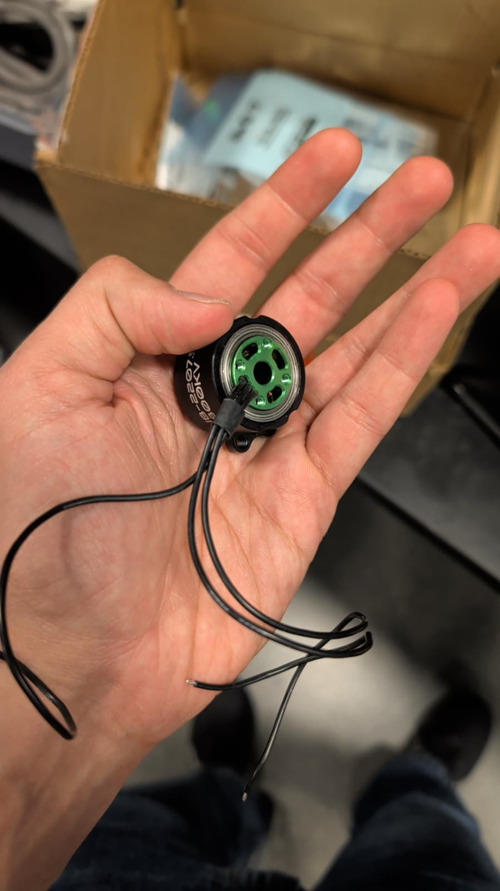

# Abhinav Lab Notebook

## Project Summary

**Project:** Combative Hardened Ultra Tumbler (`C.H.U.T.`), a compact battlebot with two drive motors, an ESP32-based controller, a brushless weapon motor, printed chassis components, and a custom PCB for power and control. The final project requirements emphasized wireless control, response under 100 ms, shutdown within 250 ms of communication loss, drivetrain speed around 2 m/s, and weapon speed above 2000 RPM [1].

**Primary responsibilities:** firmware architecture, controller interface, PWM/motor control, integration testing, ESC migration, and final system verification.

## 2026-02-13

**Objective:** Define the initial system concept and convert the battlebot idea into a buildable ECE 445 project proposal.

**Work completed:** I helped formalize the battlebot as a constrained embedded systems project instead of a vague robotics idea. The first pass at the system partition was battery, power regulation, ESP32 controller, two drive motors, one weapon motor, custom PCB, and printed chassis. I also identified that the control subsystem had to do more than simple on/off actuation; the robot needed independent left/right drive authority and a safe method to arm or disarm the weapon.

**Design decisions:** We treated the project as an integration problem with three major interfaces: electrical power, mechanical packaging, and real-time control. That framing made it easier to assign work and to define testable requirements.

**Alternatives considered:** A simpler remote-control vehicle without a weapon would have reduced risk, but it would not have exercised enough custom embedded design. A fully custom brushless control path for every motor was also discussed indirectly, but that increased firmware and driver complexity too early.

**Equations/calculations:** At this stage I recorded the control relationship that would drive later firmware design: average motor voltage under PWM is approximated by `V_avg = D * V_batt`, where `D` is duty cycle.

**Testing/debugging results:** No hardware testing yet. This entry established the control requirements that future tests would verify.

**Partner summary:** Rahul focused on motor/power architecture and likely driver choices. Shobhit started assessing whether the mass, wheel placement, and weapon geometry could fit into a printable chassis.

**Next steps:** Finalize the power tree, choose the control microcontroller, and define a motor-control interface that can be exercised before full mechanical integration.

## 2026-02-17

**Objective:** Translate high-level system requirements into a control architecture for the drive and weapon subsystems.

**Work completed:** I wrote down the control surfaces the firmware had to expose: left drive command, right drive command, weapon enable, and weapon speed command. I also noted the need for deadman behavior so loss of controller input would default the robot to a safe state. This session established that PWM would be the central actuator interface for both drive control and later ESC experiments.

**Design decisions:** I separated drive control from weapon control conceptually, because the drive motors needed bidirectional behavior while the weapon path had much stricter startup and safety concerns.

**Alternatives considered:** A single mixed drive command could have been computed off-board and sent as one steering/throttle pair, but exposing per-side control made debugging easier and reduced ambiguity during bring-up.

**Equations/calculations:** For a 4-cell LiPo, the fully charged pack voltage is `4 * 4.2 V = 16.8 V`. This value became the upper bound for any PWM-based command calculations and for later motor overvoltage risk discussions.

**Testing/debugging results:** No bench test yet. The result of the session was a clearer control contract for hardware and firmware interfaces.

**Partner summary:** Rahul continued reviewing current and voltage constraints for the motor paths. Shobhit used motor and battery size assumptions to reserve physical space in the chassis model.

**Next steps:** Align control pins with the emerging schematic and identify which signals need to be exposed for debug.

## 2026-02-24

**Objective:** Plan the ESP32 programming and reset path so firmware bring-up would not block later integration.

**Work completed:** I reviewed the ESP32 programming flow and the supporting USB-to-UART/reset circuitry needed for reliable flashing. I identified the importance of access to reset, boot, UART, and PWM pins during bring-up. This was also when I started treating debug accessibility as part of the firmware design instead of an afterthought. The ESP32-C3-WROOM-02 module documentation was the main reference for boot behavior, pin use, and the available wireless/peripheral features [3].

**Design decisions:** The board needed explicit support for programming and reset rather than assuming one-time firmware loading. A repeatable flash/debug loop was more important than minimizing parts count.

**Alternatives considered:** Using an external USB-UART adapter without onboard support would have simplified the PCB slightly, but it would have made debugging in the assembled robot more awkward.

**Equations/calculations:** No new numeric calculation. I documented a signal dependency instead: `flashability = f(power rail stability, reset path, boot strap correctness, UART access)`.

**Testing/debugging results:** This was a planning session. The main deliverable was a signal list for later board review and firmware bring-up.

**Partner summary:** Rahul was reviewing the CP2102, EN/BOOT support, protection, and general schematic integrity. Shobhit was translating connector and access needs into mechanical cutouts and cable clearance.

**Next steps:** Define a bring-up order: verify rails, verify boot, verify serial output, then verify PWM outputs before connecting power hardware.

## 2026-03-05

**Objective:** Decide what debug access the firmware team needed on the PCB.

**Work completed:** I listed the signals worth exposing during bring-up: power rails, ground, UART, reset, boot, at least one drive PWM channel, and the weapon control PWM line. I also outlined a staged debug process so motor hardware would not be energized before basic controller health was confirmed.

**Design decisions:** Test points are worth the board area because they reduce ambiguity during integration. For this project, the cost of not being able to isolate a wiring or firmware issue was higher than the cost of a few extra copper features.

**Alternatives considered:** A denser board without labeled test points would have looked cleaner, but would have slowed down bring-up and fault isolation.

**Equations/calculations:** The staged verification sequence implicitly follows dependency order: `power good -> MCU boots -> firmware runs -> PWM visible -> actuator responds`.

**Testing/debugging results:** No hardware results yet, but this became the checklist used for later bring-up sessions.

**Partner summary:** Rahul was deciding how many signals were practical to expose on the board and how to route them. Shobhit was setting up the Fusion workflow so the PCB and connectors could be referenced mechanically.

**Next steps:** Finish the PCB and transition from planning to integration-ready hardware.

## 2026-04-01

**Objective:** Refine the control and power assumptions using the partially assembled electrical and mechanical design.

**Work completed:** I summarized the system progress and updated the firmware-side power assumptions, especially the distinction between idle logic load and highly variable motor load. I noted that battery-life calculations would be dominated by motor use, but the controller still needed a stable logic rail during aggressive motion or weapon startup.

**Design decisions:** I treated logic stability as the gating requirement rather than optimizing overall battery runtime, because a brownout in the controller would be more damaging to system behavior than inefficient current draw.

**Alternatives considered:** Running closer to the edge on regulator margin might have saved space or component count, but it would have increased reset risk under load transients.

**Equations/calculations:** Battery runtime was tracked generically as `t_runtime = Capacity / I_avg`. Even without final current data, that equation kept the team focused on separating continuous electronics load from intermittent actuator load.

**Figures/diagrams/photos:** Figure A1 shows the drive motors being test-fit into the printed chassis, which directly constrained wire routing and future integration work.

**Testing/debugging results:** At this point the meaningful result was packaging progress rather than control validation. The mechanical fit check reduced uncertainty about board and harness placement.

**Partner summary:** Rahul refined the power tree and current-budget reasoning. Shobhit was validating that the printed geometry could accept the motors and leave enough room for internal hardware.

**Next steps:** Complete a first full control path from MCU output to motor behavior.

## 2026-04-08

**Objective:** Investigate the brushless weapon motor bring-up problem and determine whether the custom driver path was viable.

**Work completed:** I logged a debugging session around the brushless weapon motor behavior. The issue was that the motor did not cleanly transition into normal spin; instead, the observed behavior suggested startup trouble or misconfiguration. I treated the problem as a combined firmware/driver/state issue and started organizing the information needed to separate register configuration mistakes from wiring or motor-parameter problems. The initial custom path was based on the MCF8316A sensorless BLDC driver, so the debug process had to account for both control signaling and device configuration state [6].

**Design decisions:** I kept the debugging record centered on observable behavior, control settings, and likely fault classes instead of jumping to a single explanation. That structure mattered because later discussions about switching to an external ESC needed traceable justification.

**Alternatives considered:** We could have continued iterating on the custom brushless driver indefinitely, but that path risked consuming too much of the schedule. The alternative was to preserve the custom board for the rest of the system and externalize weapon commutation to an ESC.

**Equations/calculations:** No closed-form solution was available, but I tracked the dependency that startup success depends on correct commutation parameters, current limits, and an internally consistent command interface.

**Figures/diagrams/photos:** Figure A2 shows the brushless motor selected for the weapon path. Figure A3 shows the CAD assembly state on the same date, which is relevant because a weapon integration decision affected both control and packaging.

**Testing/debugging results:** The non-routine result was failed or inconsistent startup of the weapon motor. This became the technical basis for considering an external ESC.

**Partner summary:** Rahul analyzed the electrical/fault side of the brushless driver path. Shobhit reviewed the mounting implications of startup vibration and the safety envelope around the spinning weapon.

**Next steps:** Either stabilize the custom brushless control path quickly or switch to an external ESC to protect the schedule.

## References

1. Final presentation slides and verification results: [ECE 445 Final Presentation-1.pdf](../../ECE%20445%20Final%20Presentation-1.pdf).
2. ECE 445 Lab Notebook guide in [`guide/`](../../guide).
3. Espressif, [ESP32-C3-WROOM-02 & ESP32-C3-WROOM-02U Datasheet](https://www.espressif.com/sites/default/files/documentation/esp32-c3-wroom-02_datasheet_en.pdf).
4. Texas Instruments, [DRV8871 product page and datasheet](https://www.ti.com/product/DRV8871).
5. Texas Instruments, [LMR51430 product page and datasheet](https://www.ti.com/product/LMR51430).
6. Texas Instruments, [MCF8316A product page and datasheet](https://www.ti.com/product/MCF8316A).
7. Final schematic screenshot: [`imgs/full_schematic screenshot.png`](../../imgs/full_schematic%20screenshot.png).
8. Final PCB routing screenshot: [`imgs/route_pcb_image.png`](../../imgs/route_pcb_image.png).
9. Project photos and CAD screenshots in [`imgs/`](../../imgs).
