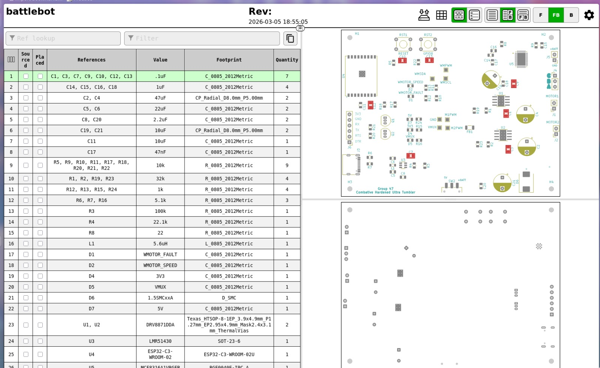
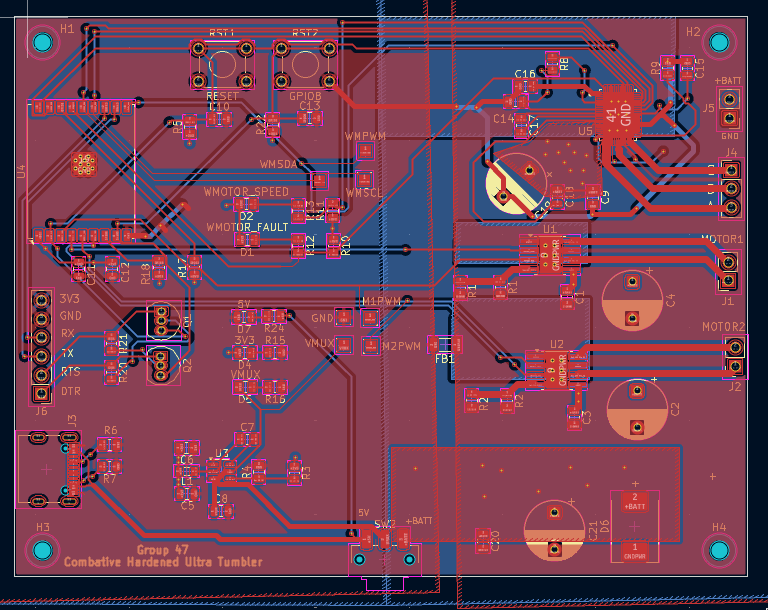

# Rahul Lab Notebook

## Project Summary

**Project:** Combative Hardened Ultra Tumbler (`C.H.U.T.`), a compact battlebot using a custom control board, LiPo power, separate drive and weapon motor paths, and a printed chassis. The electrical requirements were a stable 3.3 V rail within 3.0-3.6 V, no brownout under load, wireless response under 100 ms, and safe shutdown within 250 ms of communication loss [1].

**Primary responsibilities:** power architecture, motor-driver selection, PCB schematic/layout work, protection decisions, ESC migration for the weapon motor, and electrical debugging.

## 2026-02-13

**Objective:** Define the electrical architecture required by the battlebot concept.

**Work completed:** I broke the proposed robot into power domains and actuator classes. Two drive motors required a bidirectional brushed-motor solution, while the weapon path implied a higher-risk brushless subsystem. I also identified that the board needed battery entry, regulation for logic rails, connectors for motors, and a programming/debug path for the ESP32.

**Design decisions:** The electrical design would separate logic supply concerns from high-current actuator concerns. That separation was essential for a robot that might see large transient loads and occasional impacts.

**Alternatives considered:** A single undifferentiated motor-control approach for both drive and weapon channels would have simplified the block diagram, but would have hidden major differences in control method and current behavior.

**Equations/calculations:** The first relevant battery bounds were `V_3S,max = 3 * 4.2 V = 12.6 V` and `V_4S,max = 4 * 4.2 V = 16.8 V`. Those values framed every later compatibility discussion.

**Testing/debugging results:** No hardware testing yet. This was an architecture-definition session.

**Partner summary:** Abhinav concentrated on the control interface and the firmware assumptions behind PWM-based actuation. Shobhit started mapping component envelopes into a printable mechanical volume.

**Next steps:** Choose candidate driver ICs and decide whether 3S or 4S operation was more realistic for the performance target.

## 2026-02-24

**Objective:** Review the schematic-level support circuitry around the ESP32 and power entry.

**Work completed:** I reviewed the likely USB-UART support path, boot/reset behavior, and the need for a robust battery-to-logic power chain. I also considered where protection belonged, including transient suppression, switch placement, and clean ground reference between logic and power hardware. The board architecture was converging on an ESP32-C3-WROOM-02 controller, DRV8871 brushed-motor drivers, and an LMR51430 buck converter, so the review focused on making those pieces coexist cleanly [3][4][5].

**Design decisions:** Reliable programming, reset, and power-up behavior were treated as board-level requirements, not conveniences. I also decided that the design needed clear connectorization and accessible test points because the final robot would not be easy to probe after assembly.

**Alternatives considered:** Leaning too hard on external debug hardware would have simplified the board but would have made repeated assembly-stage debugging much harder.

**Equations/calculations:** No new numeric derivation, but I kept the power-path dependency explicit: `battery input -> protection/switching -> buck conversion -> logic rail`.

**Testing/debugging results:** This was a design review session, but it directly shaped later bring-up and reduced the chance of un-debuggable power faults.

**Partner summary:** Abhinav defined which MCU pins and control channels needed to be observable during bring-up. Shobhit incorporated connector and access needs into the early packaging plan.

**Next steps:** Translate the reviewed architecture into a routed PCB that preserves debug accessibility.

## 2026-03-05

**Objective:** Finalize PCB manufacturability choices and debug accessibility.

**Work completed:** I reviewed test-point coverage, connector placement, and the practical routing cost of exposing critical signals. I also considered current-carrying paths, the size of power copper features, and whether the board layout left enough room around headers and mounting hardware.

**Design decisions:** I favored a board that was easy to debug and assemble rather than one that was only compact. For this robot, accessible power rails and motor-control nets were worth the layout effort.

**Alternatives considered:** Omitting some test points and relying on vias or component pins as probe targets would have reduced clutter, but would have increased bring-up risk.

**Equations/calculations:** The current-density reasoning was qualitative at this stage, but the principle was simple: high-current motor traces and return paths must be kept short, wide, and easy to inspect.

**Code snippet:** I used small calculation checks like this to keep the board review tied to design current limits instead of only visual trace inspection.

```python
VBATT_FULL = 16.8
DRIVE_CURRENT_LIMIT_A = 2.0
NUM_DRIVE_CHANNELS = 2

def power(voltage, current):
    return voltage * current

per_channel = power(VBATT_FULL, DRIVE_CURRENT_LIMIT_A)
total_drive = per_channel * NUM_DRIVE_CHANNELS

print("Worst-case drive channel:", per_channel, "W")
print("Worst-case two-channel drive:", total_drive, "W")
```

**Testing/debugging results:** No bench results yet. The outcome was a more supportable PCB plan.

**Partner summary:** Abhinav defined the order in which firmware and electrical functions would be verified. Shobhit started using the board outline and connector placement to constrain the chassis.

**Next steps:** Finish schematic capture and confirm footprint/BOM integrity before fabrication.

## 2026-03-05 to 2026-03-27

**Objective:** Move from schematic capture to a routable and manufacturable board.

**Work completed:** I assembled the board data needed for ordering and review, including footprints, reference designators, and layout. The BOM screenshot shows the board at a stage where core parts and quantities were already organized, and the route view confirms that the layout reached a nearly complete state. The final routed design included the ESP32-C3-WROOM-02, two DRV8871 drive channels, the LMR51430 buck converter, and the initial MCF8316A weapon-motor path before the later external-ESC change [3][4][5][6].

**Design decisions:** The board was organized in functional regions: drive motor circuitry, MCU/programming support, power regulation, and weapon-motor hardware. Keeping those regions legible made both review and debug easier.

**Figures/diagrams/photos:** Figure R1 shows the BOM and assembled board data snapshot on 2026-03-05. Figure R2 shows the full schematic, and Figure R3 shows the routed PCB.






**Testing/debugging results:** The main result here was design completeness rather than runtime verification. The board was far enough along to support mechanical packaging and later integration.

**Partner summary:** Abhinav aligned firmware signal needs with the board interfaces. Shobhit used the board footprint and mounting-hole locations to reserve internal volume in CAD.

**Next steps:** Validate the power path and motor interfaces during bring-up.

## 2026-04-01

**Objective:** Refine power-budget reasoning once the design had stabilized enough to estimate actual operating modes.

**Work completed:** I revisited the distinction between logic current and motor current. The regulator and ESP32 current draw mattered for stability, but not nearly as much as motor load when estimating battery life. I also noted that the worst electrical stress cases would occur during starts, stalls, and weapon transients rather than during idle MCU operation. Later demo-day verification confirmed that the regulated 3.3 V rail stayed within 5% tolerance under simultaneous drivetrain and weapon loading, which is exactly the failure mode this analysis was intended to prevent [1][5].

**Design decisions:** I treated robust logic power under transient load as the most important electrical success criterion. A shorter runtime is tolerable; uncontrolled resets and brownouts are not.

**Alternatives considered:** Designing to the minimum likely current margin could have reduced component size, but it would have been a poor fit for a combat-style robot.

**Equations/calculations:** Runtime tracking followed `t_runtime = Capacity / I_avg`, but I annotated that `I_avg` must be dominated by actuator load, not by the comparatively small logic load.

**Testing/debugging results:** This was mostly an analysis session, but it informed later choices around motor compatibility and buck-converter expectations.

**Partner summary:** Abhinav updated firmware-side assumptions about safe control under power variation. Shobhit verified that the packaging still supported the board, battery, and wiring plan.

**Next steps:** Bench-test the drive and weapon electrical paths separately.

## 2026-04-08

**Objective:** Diagnose the custom brushless weapon-motor path.

**Work completed:** I treated the weapon-control problem as an electrical and driver-state issue. The observed symptom was that the brushless motor did not enter stable operation, which implied that the cause might be configuration, current limit behavior, startup parameter mismatch, or another fault condition. I compared continued driver-level debugging against the option of migrating the weapon subsystem to an external ESC. The underlying device was the MCF8316A sensorless BLDC driver, so the debugging burden included both board behavior and code-free tuning/configuration behavior [6].

**Design decisions:** I kept the problem statement broad until there were enough observations to justify a subsystem change. That prevented premature blame on the motor, firmware, or PCB alone.

**Alternatives considered:** Continue pushing on the custom brushless driver or replace it with an external ESC. The second option became more attractive as schedule pressure increased.

**Figures/diagrams/photos:** Figure R4 records the brushless motor under evaluation for the weapon subsystem.


**Testing/debugging results:** Non-routine startup behavior persisted, which meant the custom weapon path remained a schedule risk instead of a solved subsystem.

**Partner summary:** Abhinav recorded the control-side observations and used them to frame the integration decision. Shobhit evaluated the mechanical and safety consequences of vibration and incomplete startup.

**Next steps:** If the driver path cannot be stabilized quickly, move to an external ESC for the weapon motor.

## 2026-04-21

**Objective:** Support electrical bring-up for ESP32-driven motor control.

**Work completed:** I checked the interface assumptions required for drive testing: valid logic power, shared reference ground, and clean control connections from the ESP32 to the drive electronics. The main electrical role of this session was to make sure that any unexpected motion or lack of motion could be narrowed to firmware logic, mapping, or hardware response.

**Design decisions:** I treated common-ground integrity as non-negotiable. Without it, debugging PWM behavior would be ambiguous.

**Alternatives considered:** Skipping structured signal verification and going straight to full assembly would have been faster in the moment, but much worse for fault isolation.

**Equations/calculations:** No new numeric work. The electrical constraint was binary: if signal reference integrity is wrong, command interpretation is unreliable regardless of firmware quality.

**Code snippet:** During drive bring-up I used a stepped command pattern so I could check motor-driver response, common ground, and rail behavior at low speed before commanding harder ramps.

```python
import time
import requests

BASE_URL = "http://10.48.114.45"

def set_motors(m1, m2):
    requests.post(f"{BASE_URL}/set", data={"m1": m1, "m2": m2}, timeout=1)

for duty in [0, 80, 120, 160]:
    set_motors(duty, duty)
    time.sleep(1.0)      # measure VMOT, 3V3, and motor-driver temperature

set_motors(0, 0)
```

**Testing/debugging results:** The result was a more controlled drive bring-up environment and fewer plausible hidden electrical faults during software testing.

**Partner summary:** Abhinav implemented the actual host-to-robot control path. Shobhit addressed printed-hole and fit issues that would otherwise make repeated assembly/disassembly painful during testing.

**Next steps:** Finalize the weapon path electrical interface around the external ESC if needed.

## References

1. Final presentation slides and verification results: [ECE 445 Final Presentation-1.pdf](../../ECE%20445%20Final%20Presentation-1.pdf).
2. ECE 445 Lab Notebook guide in [`guide/`](../../guide).
3. Espressif, [ESP32-C3-WROOM-02 & ESP32-C3-WROOM-02U Datasheet](https://www.espressif.com/sites/default/files/documentation/esp32-c3-wroom-02_datasheet_en.pdf).
4. Texas Instruments, [DRV8871 product page and datasheet](https://www.ti.com/product/DRV8871).
5. Texas Instruments, [LMR51430 product page and datasheet](https://www.ti.com/product/LMR51430).
6. Texas Instruments, [MCF8316A product page and datasheet](https://www.ti.com/product/MCF8316A).
7. Final schematic screenshot: [`imgs/full_schematic screenshot.png`](../../imgs/full_schematic%20screenshot.png).
8. Final PCB routing screenshot: [`imgs/route_pcb_image.png`](../../imgs/route_pcb_image.png).
9. Project images in [`imgs/`](../../imgs).
