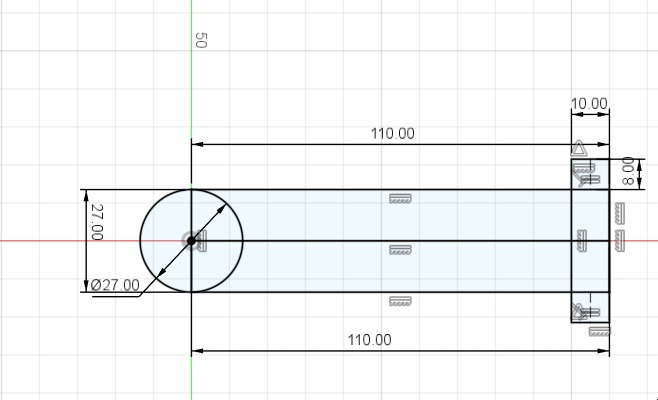

# Shobhit Lab Notebook

## Project Summary

**Project:** A compact battlebot with a printed chassis, two driven wheels, a front weapon assembly, and integrated electronics. The mechanical design was constrained by antweight rules: nominal `2 lb` class, wireless operation, and fabrication from printable thermoplastics such as PLA/PLA+ [1].

**Primary responsibilities:** chassis layout, motor mounts, skid plates, wheel selection, printed-part tolerances, weapon mounting, and final outer-shell refinement.

## 2026-02-13

**Objective:** Establish the first mechanical constraints for the battlebot concept.

**Work completed:** I translated the abstract battlebot idea into a packaging problem. The chassis had to contain battery, PCB, drive motors, wiring, and a front-mounted weapon while staying printable and serviceable. I also identified the value of a low, wide, rectangular body because it would be easier to print and easier to organize internally.

**Design decisions:** I chose to think about the design as a protected box with defined internal zones rather than a sculpted shell. That made integration with the electrical team more practical.

**Alternatives considered:** A more aggressive or curved shell could have looked better, but would have made mounting and print iteration slower.

**Equations/calculations:** The first geometric rule I noted was clearance-based rather than numeric: every major subsystem needed both footprint area and wire-routing volume, not just nominal component dimensions.

**Testing/debugging results:** No fabrication yet. This was a constraint-definition session.

**Partner summary:** Abhinav defined how the control system would connect to the actuators. Rahul defined the likely power and PCB blocks that had to be reserved inside the shell.

**Next steps:** Start CAD with a top-down layout driven by the board, motors, battery, and weapon envelope.

## 2026-03-27

**Objective:** Create the first motor-arm geometry for the front weapon support.

**Work completed:** I sketched and modeled the first version of the arm or side-support geometry used to hold the weapon motor and front assembly. The early design focused on keeping the front structure printable and attaching it cleanly to the main box body.

**Design decisions:** I used planar, bolt-together geometry instead of a more organic shape so revisions would be faster and easier to dimension.

**Code snippet:** I kept the first motor-arm geometry parameterized so the length, pivot diameter, and mounting-tab width could be changed without redrawing the entire sketch.

```python
arm_length_mm = 110
arm_width_mm = 27
pivot_diameter_mm = 27
mount_tab_mm = 10
plate_thickness_mm = 8

def motor_arm_envelope():
    return {
        "body": (arm_length_mm, arm_width_mm, plate_thickness_mm),
        "pivot_cutout_diameter": pivot_diameter_mm,
        "mount_tab_width": mount_tab_mm,
    }
```

**Alternatives considered:** Printing the front assembly as a fully blended one-piece structure would have reduced fasteners, but it would have made failure recovery and iteration harder.

**Figures/diagrams/photos:** Figure S1 shows the first weapon-arm sketch, and Figure S2 shows the first modeled motor-arm version on 2026-03-27.




**Testing/debugging results:** The result was a manufacturable first pass, not a finished part. The design still needed fit checks and likely reinforcement.

**Partner summary:** Abhinav used the emerging geometry to understand how the weapon would affect control-space and wiring. Rahul communicated connector and PCB constraints that had to remain accessible.

**Next steps:** Print the main chassis and begin real fit checks.

## 2026-03-31

**Objective:** Print the first chassis prototype and transition from CAD-only reasoning to physical validation.

**Work completed:** I sent the first chassis body to print. This was the first direct test of whether the main rectangular shell was practical in the lab’s printing workflow and whether the chosen wall and base geometry were realistic.

**Design decisions:** Prototyping early was more valuable than trying to perfect the CAD in isolation. A printed body exposes assembly and tolerance issues that are difficult to predict from the model alone.

**Figures/diagrams/photos:** Figure S3 shows the first chassis print underway on 2026-03-31.


**Testing/debugging results:** Printing itself was the test. The output enabled the next round of physical fit and mounting checks.

**Partner summary:** Abhinav and Rahul were both waiting on physical geometry to validate wire routing, board placement, and accessible control connections.

**Next steps:** Fit motors into the chassis and start refining supporting structures such as skids and mount geometry.

## 2026-04-01

**Objective:** Verify that the printed chassis accepted the drive motors and internal mechanical layout.

**Work completed:** I performed a real fit check with the drive motors inside the printed shell. This let me confirm that the simple rectangular body was large enough to accept the motors while still leaving central volume for the electronics stack.

**Design decisions:** I kept the body as an open-top box during this phase so repeated insertion, removal, and measurement of parts would be easy.

**Alternatives considered:** Closing the body too early with a finalized lid would have slowed iteration and made internal packaging much harder to inspect.

**Figures/diagrams/photos:** Figure S4 shows the drive motors fitted into the printed chassis on 2026-04-01.


**Testing/debugging results:** The fit test reduced uncertainty around internal volume and wheel-track placement.

**Partner summary:** Abhinav used the fit result to keep the control layout realistic. Rahul used it to confirm that board and connector space remained available.

**Next steps:** Iterate the skid design and front-end geometry.

## 2026-04-05

**Objective:** Develop the front skid geometry and compare alternatives quickly in CAD.

**Work completed:** I created multiple skid variants on the same day, which indicates the first pass was not yet satisfactory. The progression from first draft to second draft to integrated assembly view shows a rapid design loop focused on front-end ground interaction and fit with the box chassis.

**Design decisions:** I kept the skids as separate printed parts mounted to the chassis rather than integrating them permanently into the shell. That made orientation, replacement, and angle changes easier.

**Alternatives considered:** A more aggressive single-piece front undertray might have looked cleaner, but separate skids were lower risk and easier to revise.

**Figures/diagrams/photos:** Figure S5 shows the first skid draft, Figure S6 shows the second skid draft, and Figure S7 shows the chassis assembly after skid integration on 2026-04-05.


**Testing/debugging results:** The need for multiple same-day variants was itself a useful result. It showed that the front contact geometry needed iteration and could not be trusted from the first model alone.

**Partner summary:** Abhinav checked that the skid geometry did not interfere with planned control or test access. Rahul checked that front-end additions would not block connector or wiring space.

**Next steps:** Print the revised chassis and skid set, then move toward the weapon mount.

## 2026-04-06

**Objective:** Produce the revised printed parts after the skid iteration.

**Work completed:** I sent the updated chassis and skid parts to print. This was the mechanical equivalent of committing the new front-end geometry to a real test part.

**Design decisions:** Fast prototype cycles were prioritized over cosmetic refinement. At this stage, every print was meant to answer a fit or assembly question.

**Code snippet:** Before sending the revised chassis/skids to print, I used a simple clearance checklist to decide whether the print should be treated as a fit prototype or a final part.

```python
checks = {
    "m3_clearance_hole_mm": 3.2,
    "wall_thickness_mm": 3.0,
    "skid_ground_clearance_mm": 2.0,
    "motor_wire_clearance_mm": 5.0,
}

for item, value in checks.items():
    print(f"{item}: target >= {value}")
```

**Figures/diagrams/photos:** Figure S8 shows the revised chassis and skids being printed on 2026-04-06.


**Testing/debugging results:** The print queued the next physical assembly round and reduced dependence on CAD-only assumptions.

**Partner summary:** Abhinav and Rahul both benefited because this print cycle would directly affect where the board, harnesses, and motors could be mounted.

**Next steps:** Validate the weapon support and shaft/coupling design.

## 2026-04-09

**Objective:** Evaluate the weapon shaft or coupler approach under real hardware conditions.

**Work completed:** A physical failure occurred in the shaft/coupler mechanism. The shaft piece separated from the assembly, making it clear that the first implementation was not mechanically robust enough.

**Design decisions:** After the failure, it was clear the front weapon structure needed a more secure transmission path between motor and weapon or a stronger printed support geometry.

**Alternatives considered:** Continue with the same shaft concept or redesign the coupling and surrounding support. The failure strongly favored redesign.

**Figures/diagrams/photos:** Figure S9 records the failed shaft/coupler condition on 2026-04-09.


**Testing/debugging results:** This was a clear non-routine mechanical result and one of the most important failures to document. It directly justified later redesign work.

**Partner summary:** Abhinav needed this information because unreliable weapon transmission would affect control and safety assumptions. Rahul needed it because motor and driver success were meaningless without a mechanically sound load path.

**Next steps:** Rework the wheel/motor-shaft interface and continue strengthening the front assembly.

## 2026-04-14 to 2026-04-16

**Objective:** Improve wheel selection, print the next part set, and reach a first full assembly.

**Work completed:** I finalized a wheel choice, printed the chassis with the weapon and motor holders, and then assembled the first full physical version of the robot. This was the key transition from isolated printed parts to a robot that could be inspected as a full mechanical package. The design priorities remained compact packaging, structural strength, and easy assembly [1].

**Design decisions:** The chosen wheel size and the printed holders balanced availability, fit, and the need for a stable stance. I also kept the assembly modular enough that parts could still be changed without remaking the entire shell.

**Alternatives considered:** Continue evaluating alternate wheels or commit to a final wheel set. The dated photos show that by mid-April the project needed commitment more than additional wheel indecision.

**Figures/diagrams/photos:** Figure S10 shows the selected wheels on 2026-04-14. Figure S11 shows the printed chassis, weapon, and motor holders. Figure S12 shows the first full real-life assembly on 2026-04-16.


**Testing/debugging results:** The successful full assembly exposed the final fit, wiring-space, and weapon-support issues that still needed refinement before the last chassis revision.

**Partner summary:** Abhinav could now reason about complete-system control and test setup. Rahul could inspect real wiring space, board placement, and connector accessibility.

**Next steps:** Refine the weapon mounts and wheel-to-shaft interface.

## 2026-04-15 to 2026-04-24

**Objective:** Improve the wheel-shaft coupling and redesign the weapon motor supports.

**Work completed:** I created a dedicated mechanism to mount the wheel to the motor shaft and later revised the front motor arms to accommodate the brushless weapon motor. The revised arms show a stronger and more specialized interface than the early sketch and first arm model.

**Design decisions:** I moved away from generic geometry toward hardware-specific mounting features. That reduced ambiguity at assembly time and better matched the actual purchased components.

**Alternatives considered:** Keep adapting the first arm concept or create a new, brushless-specific support strategy. The later parts show that a targeted redesign was necessary.

**Figures/diagrams/photos:** Figure S13 shows the wheel-to-motor-shaft mechanism on 2026-04-15, and Figure S14 shows the new motor arms for the brushless weapon motor on 2026-04-24.


**Testing/debugging results:** These redesigned parts were driven directly by earlier mechanical failures and fit constraints.

**Partner summary:** Abhinav used the more realistic motor mount geometry when thinking about final weapon control and safety. Rahul used it to understand connector orientation, motor wiring path, and the feasibility of the selected weapon motor.

**Next steps:** Finish protective outer geometry and prepare a clean final mechanical package.

## 2026-04-30

**Objective:** Develop the wheel protector from concept to near-final geometry in one work session.

**Work completed:** I moved from a first wheel-protector draft to a second draft on the same day, with an intermediate planning sketch for the revised geometry. The quick progression shows that I was tuning clearance, printability, and coverage simultaneously.

**Design decisions:** The wheel protector had to shield the wheel without rubbing under normal motion and without becoming a large unsupported printed span. I therefore iterated in small steps rather than committing to one heavy design.

**Code snippet:** I used this clearance logic when sizing the second wheel-protector draft so the shield protected the tire without rubbing during normal driving.

```python
wheel_radius_mm = 35.0
tire_clearance_mm = 3.0
protector_wall_mm = 3.0

inner_radius_mm = wheel_radius_mm + tire_clearance_mm
outer_radius_mm = inner_radius_mm + protector_wall_mm

print("protector inner radius:", inner_radius_mm)
print("protector outer radius:", outer_radius_mm)
```

**Alternatives considered:** Leave the wheel exposed, or add a protective shell. The protector was worth the added part count because it reduced side exposure and improved the finished form factor.

**Figures/diagrams/photos:** Figure S15 shows the first wheel-protector draft, Figure S16 shows the planning sketch for the second draft, Figure S17 shows the second draft, and Figure S18 shows the final CAD assembly state with the integrated outer geometry.


**Testing/debugging results:** The multiple same-day versions show active design iteration and provide a clear paper trail for the final protective geometry.

**Partner summary:** Abhinav used the final CAD for system explanation and integration planning. Rahul used it to confirm that external electrical additions such as the ESC still had a viable packaging location.

**Next steps:** Weigh the newest printed parts and assemble the final robot.

## 2026-05-01 to 2026-05-03

**Objective:** Close out the mechanical build with final printed-part mass checks and the completed assembly.

**Work completed:** I weighed the newly printed parts, then assembled and photographed the final robot. By this stage the major mechanical questions had shifted from geometry creation to validation that the complete outer shell, weapon support, and protectors still formed a coherent package. During demo-day stability testing, this final integrated chassis ran while the drivetrain and weapon subsystems were both active, so the mechanical packaging had to survive vibration, floor-driving loads, and wiring movement under real operating conditions [1].

**Design decisions:** The final form kept the rectangular body with bolt-on front structure and protective side geometry. This kept the robot serviceable and consistent with the earlier print-iterate-assemble process.

**Figures/diagrams/photos:** Figure S19 shows the printed-part weighing step on 2026-05-01, and Figure S20 shows the final robot on 2026-05-03.


**Testing/debugging results:** The final assembly confirmed that the design reached a stable end state after several mechanical revisions, including skid changes, coupling failure, wheel selection, and weapon mount redesign. The combined-load stability test also supports the claim that the chassis and mounting strategy were mechanically serviceable in the final demo configuration, because the integrated platform stayed operational while both drivetrain and weapon loading were present [1].

**Partner summary:** Abhinav closed out system integration and the control narrative. Rahul closed out board, power, and protection documentation.

**Next steps:** Make the packaging denser in future mechanical revisions while preserving wheel protection, and record final printed dimensions and total mass during assembly.

## References

1. Final presentation slides and verification results: [ECE 445 Final Presentation-1.pdf](../../ECE%20445%20Final%20Presentation-1.pdf).
2. ECE 445 Lab Notebook guide in [`guide/`](../../guide).
3. Project CAD and build photos in [`imgs/`](../../imgs).
